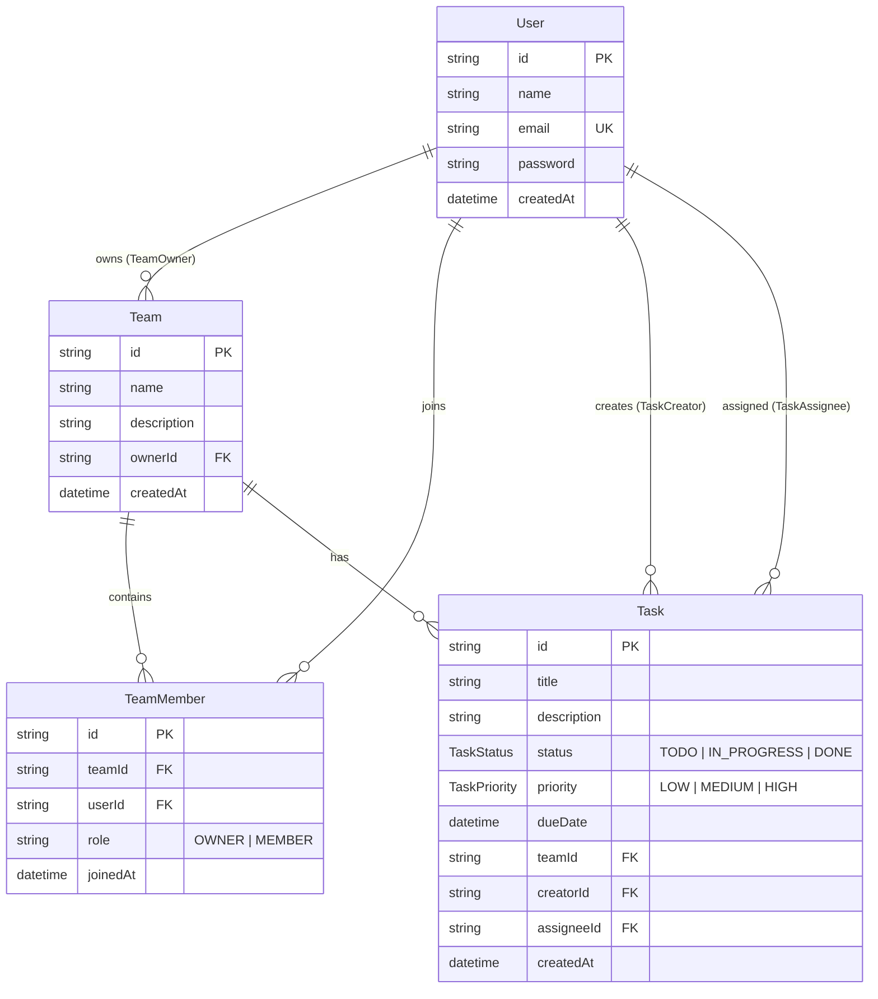

# Task & Team Management App

A complete, full-stack **Task & Team Management Application** built for **Assignment 2** using Next.js (App Router), TypeScript, Prisma ORM, PostgreSQL (hosted on Supabase), and Tailwind CSS.

---

## 1. Submission Information

* **Student ID:** *(Fill in your Student ID)*
* **Full Name:** *(Fill in your Full Name)*
* **GitHub Repository URL:** *(Your public repo URL)*
* **Deployed Website URL (Vercel):** *(Your Vercel deployment URL)*
* **Separate Backend URL (NestJS on Render) — write N/A if not used:** `N/A`
* **Test Account Email:** `demo@example.com`
* **Test Account Password:** `Password123@`
* **This test account is already email-verified / ready to log in immediately, with no confirmation link needed (Yes / No):** `Yes`
* **Self-registration works, so a grader can create their own account (Yes / No):** `Yes`

---

## 2. Tech Stack

* **Framework:** [Next.js](https://nextjs.org/) (App Router, Route Handlers)
* **Language:** [TypeScript](https://www.typescriptlang.org/)
* **Database ORM:** [Prisma ORM](https://www.prisma.io/)
* **Database:** [PostgreSQL](https://www.postgresql.org/) (Hosted on [Supabase](https://supabase.com/))
* **Authentication:** JWT Session via HTTP-only Cookies (`jose`, `bcryptjs`)
* **Styling:** [Tailwind CSS](https://tailwindcss.com/)
* **Code Quality:** [ESLint](https://eslint.org/) & [Prettier](https://prettier.io/)
* **Deployment:** [Vercel](https://vercel.com/)

---

## 3. Assignment 2 Features Checklist

### 3.1. Authentication (Xác thực người dùng)
* [x] **Registration (`POST /api/auth/register`):** Form with Name, Email, Password. Validates email format, unique email, password length >= 6.
* [x] **Login (`POST /api/auth/login`):** Validates email & password, signs JWT token stored in HTTP-only Cookie.
* [x] **Logout (`POST /api/auth/logout`):** Clears authentication cookie and redirects to `/login`.
* [x] **Route Protection:** Unauthenticated users can only access Home (`/`), Login (`/login`), and Register (`/register`). Protected areas (`/dashboard`, `/teams`, `/teams/:id`) automatically require login and redirect unauthenticated users.
* [x] **Test Account:** Pre-configured `demo@example.com` (`Password123@`), ready to log in immediately without confirmation links.

### 3.2. Team Management (Quản lý Team)
* [x] **Create Team (`POST /api/teams`):** Any authenticated user can create a Team with Name & optional Description. The creator **automatically becomes the Owner** of the team.
* [x] **List User Teams (`GET /api/teams`):** Returns only the teams the current user belongs to, with member/task counts and owner info.
* [x] **Team Details (`GET /api/teams/:id`):** Displays Team Info, Members, and Tasks. Accessible only to team members/owner.
* [x] **Update Team (`PUT /api/teams/:id`):** **Owner-only** action to update team name and description.
* [x] **Delete Team (`DELETE /api/teams/:id`):** **Owner-only** action to delete the team and cascade tasks/members.

### 3.3. Team Members & Roles (Thành viên & Vai trò)
* [x] **Add Member (`POST /api/teams/:id/members`):** Team Owner can add any registered user by email address.
* [x] **Remove Member (`DELETE /api/teams/:id/members/:userId`):** Team Owner can remove members from the team (Owner cannot remove themselves).
* [x] **Roles Supported:** `OWNER` (full team administration) and `MEMBER` (task collaboration).
* [x] **Multiple Teams & Team Switching:** Users can belong to multiple teams (as Owner in some, Member in others) and easily switch between them using the **Switch Team** selector.

### 3.4. Task Management & Authorization (Quản lý Task & Phân quyền)
* [x] **Task Fields:** Title (required), Description (optional), Status (`TODO`, `IN_PROGRESS`, `DONE`), Priority (`LOW`, `MEDIUM`, `HIGH`), Due Date (optional), Team (required relation), Assignee (optional, must belong to team).
* [x] **Create Task (`POST /api/teams/:id/tasks`):** Any team member can create tasks in the team.
* [x] **Update Task (`PUT /api/tasks/:id`):** Any team member can update title, description, status, priority, due date, and assignee.
* [x] **Delete Task Authorization (`DELETE /api/tasks/:id`):** Enforced on both **API and UI** — only the following 3 roles can delete a task:
  1. **Task Creator** (`creatorId === userId`)
  2. **Task Assignee** (`assigneeId === userId`)
  3. **Team Owner** (`team.ownerId === userId`)
  *(Other team members receive HTTP 403 Forbidden).*

### 3.5. Bonus Features
* [x] **Kanban Board:** Toggle between List View and Kanban Board with Status columns (`To Do`, `In Progress`, `Done`).
* [x] **Filter & Search:** Real-time search by task keyword, status filter, and priority filter.

---

## 4. REST API Documentation

| Method | Endpoint | Description | Access Control |
|---|---|---|---|
| `POST` | `/api/auth/register` | Register new user account | Public |
| `POST` | `/api/auth/login` | Authenticate user and issue session | Public |
| `POST` | `/api/auth/logout` | Terminate session | Authenticated |
| `GET` | `/api/auth/me` | Get current session user | Authenticated |
| `GET` | `/api/teams` | Get teams user belongs to | Authenticated |
| `POST` | `/api/teams` | Create new team (creator = OWNER) | Authenticated |
| `GET` | `/api/teams/:id` | Get team details, members, tasks | Team Member / Owner |
| `PUT` | `/api/teams/:id` | Update team name & description | **Team Owner only** |
| `DELETE` | `/api/teams/:id` | Delete team | **Team Owner only** |
| `POST` | `/api/teams/:id/members` | Add member by email | **Team Owner only** |
| `DELETE` | `/api/teams/:id/members/:userId` | Remove member from team | **Team Owner only** |
| `GET` | `/api/teams/:id/tasks` | List tasks in team | Team Member / Owner |
| `POST` | `/api/teams/:id/tasks` | Create task in team | Team Member / Owner |
| `PUT` | `/api/tasks/:id` | Update task details / status / priority | Team Member / Owner |
| `DELETE` | `/api/tasks/:id` | Delete task | **Creator OR Assignee OR Team Owner** |

---

## 5. Database Schema (Prisma)



---

## 6. Seed Data & Test Accounts

Run the database seeder to populate sample teams, members, and tasks:

```bash
npm run seed
```

### Pre-configured Accounts:

| Account | Email | Password | Pre-seeded Teams & Roles |
|---|---|---|---|
| **Primary Test Account (Grader)** | `demo@example.com` | `Password123@` | **Owner** of *AI & Cloud Development*, **Member** of *Marketing & Product Growth* |
| **Colleague Account** | `member@example.com` | `Password123@` | **Member** of *AI & Cloud Development*, **Owner** of *Marketing & Product Growth* |

---

## 7. Local Setup Instructions

1. **Clone repository:**
   ```bash
   git clone <repository-url>
   cd task-team-management
   ```

2. **Install dependencies:**
   ```bash
   npm install
   ```

3. **Configure Environment:**
   Create `.env` file with your database connection:
   ```env
   DATABASE_URL="postgresql://postgres:[PASSWORD]@[HOST]:5432/postgres?pgbouncer=true"
   DIRECT_URL="postgresql://postgres:[PASSWORD]@[HOST]:5432/postgres"
   JWT_SECRET="your-secure-jwt-secret"
   ```

4. **Run migrations & seed:**
   ```bash
   npx prisma migrate deploy
   npm run seed
   ```

5. **Start Development Server:**
   ```bash
   npm run dev
   ```
   Open [http://localhost:3000](http://localhost:3000).

6. **Production build check:**
   ```bash
   npm run build
   ```
